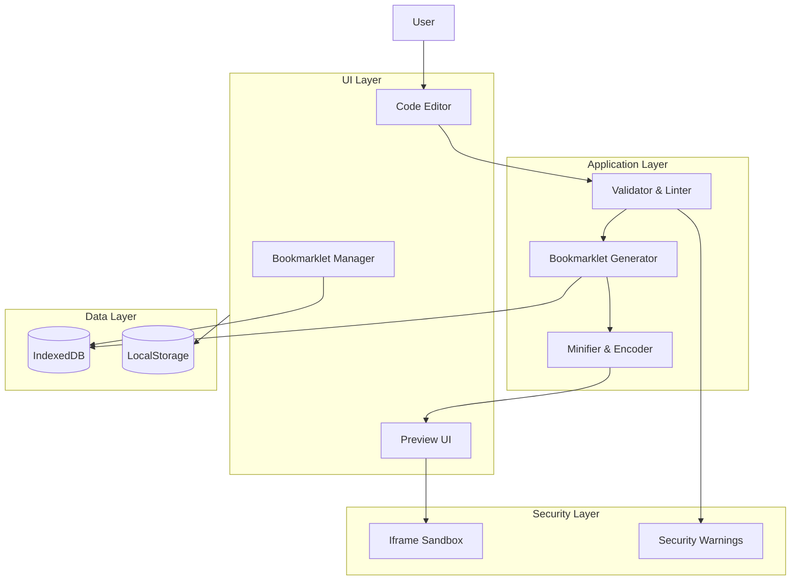

# 📘 Product Requirements Document (PRD)
## Produktname: Bookmarklets Creator

---

## 1. Ziel & Vision

### 1.1 Problemstellung
Bookmarklets sind kleine JavaScript-Programme, die direkt im Browser ausgeführt werden können. Trotz ihres hohen Nutzens sind sie für viele Nutzer schwer zugänglich:

- Hohe Einstiegshürde durch JavaScript-Syntax
- Fehleranfälligkeit (Encoding, `javascript:`-Prefix, Minifizierung)
- Fehlende Test- und Vorschaufunktionen
- Keine strukturierte Verwaltung

### 1.2 Produktvision
Der Bookmarklets Creator soll eine zentrale, benutzerfreundliche Plattform sein, um Bookmarklets:

- einfach zu erstellen (Code & No-/Low-Code)
- sicher zu testen
- übersichtlich zu verwalten
- schnell zu exportieren und wiederzuverwenden

**Vision:** Bookmarklets werden zu einem alltäglichen Produktivitätswerkzeug – nicht nur für Entwickler, sondern für alle Power-User.

---

## 2. Zielgruppen

### 2.1 Primäre Zielgruppen
- Frontend- & Full-Stack-Entwickler
- QA, SEO- & Product-Manager
- Knowledge-Worker mit technischem Hintergrund

### 2.2 Sekundäre Zielgruppen
- Studierende & Lernende
- Automatisierungs-Enthusiasten
- PKM- & Obsidian-Nutzer

---

## 3. Use Cases

| Use Case | Beschreibung |
|---------|--------------|
| DOM-Manipulation | Elemente hervorheben, entfernen, analysieren |
| Content-Extraktion | Texte, Links oder Bilder sammeln |
| Debugging | CSS-Overlays, Logs, Statusanzeigen |
| Produktivität | Copy-to-Clipboard, Autofill |
| SEO-Analyse | Meta-Tags & Strukturdaten anzeigen |

---

## 4. Funktionale Anforderungen

### 4.1 Bookmarklet Editor

- JavaScript-Code-Editor mit Syntax-Highlighting
- Automatische Generierung des `javascript:`-Bookmarklets
- Minifizierung & Encoding
- Fehler- und Syntaxprüfung

**Must-Have:**
- Live-Preview
- Undo / Reset

---

### 4.2 Bookmarklet Management

- Übersichtliche Liste aller Bookmarklets
- Tags & Kategorien
- Favoriten & Suche

---

### 4.3 Test & Preview

- Sandbox-Ausführung (Iframe)
- Test auf frei wählbarer URL
- Anzeige von Console-Logs

---

### 4.4 Export & Nutzung

- Drag & Drop in die Bookmark-Leiste
- Exportformate:
  - `.txt`
  - `.md`
  - `.json`
- Copy-to-Clipboard

---

## 5. Nicht-funktionale Anforderungen

### 5.1 Sicherheit

- Keine serverseitige Code-Ausführung
- Sandbox-Isolation
- Warnungen bei unsicheren APIs (`eval`, Cookies, Storage)

### 5.2 Performance

- Editor-Reaktion < 100 ms
- Minify < 200 ms
- Kein Page-Reload

### 5.3 Usability

- Dark / Light Mode
- Tastaturfreundlich
- Desktop-first

---

## 6. MVP Scope

**In Scope:**
- JavaScript Editor
- Bookmarklet Generator
- Minify & Encode
- Bookmarklet Liste
- Export & Copy

**Out of Scope:**
- Benutzerkonten
- Sharing
- No-Code Builder

---

## 7. KPIs

- Erstellte Bookmarklets pro Nutzer
- Wiederkehrende Nutzer
- Export-Rate
- Fehlerquote im Editor

---

## 8. Offene Punkte

- Web-only oder Desktop-Version
- Dev-first oder No-Code-first
- KI-Unterstützung (später?)

---

---

## 9. User Journey (MVP)

### Persona
**Name:** Alex
**Rolle:** Technisch versierter Knowledge Worker / Entwickler
**Ziel:** Ein funktionierendes Bookmarklet erstellen, testen und im Browser nutzen

---

### Journey – Happy Path

1. **Landing & Einstieg**
   - Alex öffnet den Bookmarklets Creator im Browser
   - Klare CTA: „Neues Bookmarklet erstellen“

2. **Editor-Phase**
   - JavaScript-Editor mit Beispiel-Code wird angezeigt
   - Alex passt den Code an (Syntax-Highlighting, Linting aktiv)
   - Inline-Fehlermeldungen bei Syntaxfehlern

3. **Generierung**
   - Klick auf „Generieren“
   - Tool erzeugt automatisch:
     - `javascript:`-Prefix
     - minifizierten & encodierten Code

4. **Test & Preview**
   - Alex gibt eine Test-URL ein
   - Bookmarklet läuft in Sandbox-Iframe
   - Console-Logs werden angezeigt

5. **Speichern & Organisation**
   - Bookmarklet erhält Namen & Tags
   - Speicherung lokal (LocalStorage / IndexedDB)

6. **Export & Nutzung**
   - Drag & Drop in die Bookmark-Leiste
   - Alternativ: Copy-to-Clipboard

---

### Edge Cases

- ❌ Syntaxfehler → Blockierte Generierung + Fehlermeldung
- ⚠️ Unsichere APIs (`eval`) → Sicherheitswarnung
- 🔄 Seitenreload → Bookmarklets bleiben erhalten

---

---

## 10. Technische Feinspezifikation (MVP)

### 10.1 Gesamtüberblick

Der Bookmarklets Creator ist eine **reine Client-Side-Webanwendung** (MVP), ohne serverseitige Code-Ausführung. Alle Daten werden lokal gespeichert.

---

### 10.2 Frontend-Architektur

**Framework (Vorschlag):** React oder Vue (SPA)

**Hauptmodule:**

1. **App Shell**
   - Routing (Editor / Übersicht)
   - Theme (Light / Dark)

2. **Bookmarklet Editor**
   - Code-Editor (Monaco oder CodeMirror)
   - Syntax-Highlighting
   - Linting (ESLint light)
   - Undo / Redo

3. **Bookmarklet Generator**
   - Wrapping mit `javascript:`
   - Minifizierung (z. B. Terser)
   - URL-Encoding

4. **Preview & Sandbox**
   - Iframe mit `sandbox`-Attribut
   - Isolierte Ausführung
   - Console-Log-Capture

5. **Bookmarklet Manager**
   - Listenansicht
   - Tags, Suche, Favoriten

---

### 10.3 Datenmodelle

```ts
Bookmarklet {
  id: string
  name: string
  description?: string
  tags: string[]
  sourceCode: string
  generatedCode: string
  createdAt: timestamp
  updatedAt: timestamp
}
```

---

### 10.4 Persistenz

- **LocalStorage** (Settings)
- **IndexedDB** (Bookmarklets)

Kein Login, kein Sync im MVP.

---

### 10.5 Sicherheit

- Keine serverseitige Ausführung
- Iframe-Sandbox (`allow-scripts` ohne `allow-same-origin`)
- Static Analysis:
  - Warnungen bei `eval`, `document.cookie`, `fetch`

---

### 10.6 Performance

- Lazy Loading für Editor
- Debounced Minify
- Kein globaler Re-Render

---

---

## 11. MVP-Architekturdiagramm

### 11.1 Architekturprinzipien

- Client-only (kein Backend im MVP)
- Security by Isolation (Sandbox, keine Code-Ausführung außerhalb des Browsers)
- Offline-fähig (LocalStorage / IndexedDB)
- Erweiterbar für spätere Backend-Anbindung

---

### 11.2 Logische Architektur (Layer-Modell)

**UI Layer**
- App Shell
- Editor View
- Manager View
- Preview View

**Application Layer**
- Bookmarklet Generator
- Validator & Linter
- Minifier & Encoder
- Preview Controller

**Data Layer**
- IndexedDB (Bookmarklets)
- LocalStorage (Settings, UI-State)

**Security Layer (querliegend)**
- Static Code Analysis
- Iframe Sandbox
- API Usage Warnings

---

### 11.3 Datenfluss (vereinfacht)

1. Nutzer gibt JavaScript im Editor ein
2. Validator prüft Syntax & Sicherheitsregeln
3. Generator erzeugt Bookmarklet-Code
4. Preview führt Code isoliert im Iframe aus
5. Bookmarklet wird lokal gespeichert
6. Export / Drag & Drop in Browser-Leiste

---

### 11.4 Architekturdiagramm (Mermaid)



---

### 11.5 Erweiterungspfade (Post-MVP)

- Optionales Backend (Sync, Sharing)
- Account-System
- KI-Assistenz für Code-Generierung
- No-Code / Block-Editor

---

---

## 12. KI-Feature-Design – Prompt → Bookmarklet

### 12.1 Ziel des KI-Features

Das KI-Feature ermöglicht es Nutzern, **Bookmarklets in natürlicher Sprache zu beschreiben**, die anschließend automatisch als funktionierender JavaScript-Code generiert werden.

**Ziel:**
- Einstiegshürde weiter senken
- Schnelle Prototypen ermöglichen
- Lernhilfe für JavaScript & DOM-APIs bieten

---

### 12.2 Typische User Prompts

- „Markiere alle externen Links auf der Seite rot“
- „Kopiere alle Überschriften (h1–h3) in die Zwischenablage“
- „Blende alle Bilder größer als 500px aus“
- „Zeige mir alle Meta-Tags in einem Alert“

---

### 12.3 UX-Flow (KI-Unterstützung)

1. Nutzer klickt auf **„Mit KI erstellen“**
2. Texteingabefeld für natürliche Sprache
3. Optional: Auswahl von Presets (DOM, SEO, Content, Debug)
4. KI generiert:
   - JavaScript-Quellcode
   - Kurzbeschreibung
5. Ergebnis wird:
   - im Code-Editor angezeigt
   - automatisch validiert
6. Nutzer kann:
   - Code anpassen
   - direkt generieren & testen

---

### 12.4 Technische Einbindung (Post-MVP)

**Architekturvariante:**

- Frontend sendet Prompt an KI-Service
- KI liefert reinen JavaScript-Code + Metadaten zurück
- Kein direkter Zugriff der KI auf Nutzerdaten oder Seiteninhalte

**Empfohlene Sicherheitsmaßnahmen:**
- Output-Filter (kein `eval`, kein Tracking)
- Max. Code-Länge
- Explain-Mode (Code wird kommentiert)

---

### 12.5 Prompt-Template (intern)

```text
Du bist ein JavaScript-Experte für Browser-Bookmarklets.
Erstelle ein sicheres Bookmarklet, das:
- keine externen Requests ausführt
- ohne eval auskommt
- nur Standard-DOM-APIs nutzt

Aufgabe:
{USER_PROMPT}

Gib ausschließlich JavaScript-Code zurück.
```

---

### 12.6 Qualitätsmetriken für KI-Code

- ✔️ Lauffähig ohne Anpassung
- ✔️ Keine Syntaxfehler
- ✔️ Verständliche Struktur
- ✔️ Sicherheitsregeln eingehalten

---

### 12.7 Erweiterungen

- Prompt-Historie
- Mehrere Code-Varianten
- Erklärmodus („Was macht dieses Bookmarklet?“)
- Community-Prompts

---

---

## 13. KI-Prompt-Bibliothek (Best Practices)

### 13.1 Ziel

Die KI-Prompt-Bibliothek stellt geprüfte, wiederverwendbare Prompt-Vorlagen bereit, um konsistente, sichere und qualitativ hochwertige Bookmarklets zu erzeugen.

---

### 13.2 Prompt-Kategorien

- **DOM-Manipulation** (Markieren, Entfernen, Stylen)
- **Content-Extraktion** (Texte, Links, Tabellen)
- **SEO & Analyse** (Meta-Tags, Headings, Alt-Texte)
- **Debugging** (Overlays, Infos, Statusanzeigen)
- **Produktivität** (Copy, Alerts, Autofill)

---

### 13.3 Prompt-Vorlagen (Beispiele)

**DOM – Markieren**
> „Markiere alle Elemente, die dem CSS-Selektor `{selector}` entsprechen, visuell mit einem Rahmen.“

**Content – Extraktion**
> „Extrahiere alle `{element}` und kopiere sie als Liste in die Zwischenablage.“

**SEO – Analyse**
> „Zeige alle Meta-Tags mit Name und Content strukturiert an.“

---

### 13.4 Prompt-Guidelines

- Ein Ziel pro Prompt
- Keine Mehrdeutigkeit
- Klare DOM-Bezüge
- Keine Netzwerk- oder Tracking-Aktionen

---

## 14. Explain- & Learning-Mode (Code → Erklärung)

### 14.1 Ziel

Der Explain-Mode hilft Nutzern, generierten oder vorhandenen JavaScript-Code zu verstehen und daraus zu lernen.

---

### 14.2 UX-Flow

1. Nutzer klickt auf **„Code erklären“**
2. KI analysiert den aktuellen Code
3. Ausgabe:
   - Abschnittsweise Erklärung
   - Hinweise zu verwendeten APIs
   - Sicherheitsrelevante Stellen

---

### 14.3 Ausgabeformate

- Klartext-Erklärung
- Kommentierter Code
- Optional: Lern-Tipps („Warum so?“)

---

### 14.4 Qualitätskriterien

- Verständliche Sprache
- Keine Halluzinationen
- 1:1 Bezug zum Code

---

## 15. Community Library & Moderationskonzept

### 15.1 Ziel

Eine öffentliche Sammlung geprüfter Bookmarklets, erstellt von der Community.

---

### 15.2 Inhalte

- Bookmarklet-Code
- Beschreibung & Use Case
- Tags & Kategorien
- Schwierigkeit (Einsteiger / Fortgeschritten)

---

### 15.3 Moderation

- Automatische Sicherheitsprüfung
- Community-Reporting
- Manuelle Freigabe (Initialphase)

---

### 15.4 Governance

- Klare Nutzungsregeln
- Versionierung
- Autoren-Nennung

---

## 16. Backlog & Roadmap (MVP → v1.0)

### Phase 0 – MVP (abgeschlossen)
- Core Editor
- Generator
- Preview
- Local Storage

---

### Phase 1 – v0.9
- KI Prompt → Bookmarklet
- Prompt-Bibliothek
- Explain-Mode

---

### Phase 2 – v1.0
- Community Library
- Sharing & Import
- Optionale Accounts

---

### Phase 3 – v1.x
- No-Code Builder
- Versionierung
- Plugin-System

---

**Dokumentstatus:** Produkt- & Zukunftskonzept vollständig abgeschlossen.

